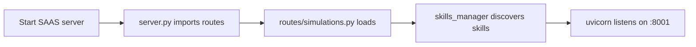

# VAN_Engine — Persistent Resource Index

Maintained as part of bootup protocol. Update this file whenever adding/moving key resources.

---

## 1. Voice & TTS Models

| Resource | Path | Status |
|----------|------|--------|
| Amy voice (ONNX) — active | `saas/src/voice/models/en_US-amy-medium.onnx` | ✅ 63MB |
| Amy voice (ONNX) — active | `saas/src/voice/models/en_US-amy-medium.onnx` | ✅ 63MB |
| Amy voice (ONNX) — primary fallback | `ClawDia/src/tools/master_skills/models/piper/en_US-amy-medium.onnx` | ✅ 63MB |
| Amy config (JSON) — active | `saas/src/voice/models/en_US-amy-medium.json` | ✅ 4.8KB |
| Amy config (JSON) — fallback | `ClawDia/src/tools/master_skills/models/piper/en_US-amy-medium.json` | ✅ 4.8KB |
| Amy voice — archive source | `archive/old_projects_archive/VoiceAdapterStudio/models/en_US-amy-medium.onnx` | 🔴 stale |
| Amy voice — external source | `C:\Users\User\Documents\!Deepseek\DirtyTalker/en_US-amy-medium.onnx` | ✅ golden copy |
| Amy config — external source | `C:\Users\User\Documents\!Deepseek\DirtyTalker/en_US-amy-medium.onnx.json` | ✅ golden copy |

**Model dirs (populated):**
- `saas/src/voice/models/` — ✅ en_US-amy-medium.onnx + .json
- `ClawDia/src/tools/master_skills/models/piper/` — ✅ en_US-amy-medium.onnx + .json

---

## 2. Simulations (SAAS Portal)

| Route | HTML File | Status |
|-------|-----------|--------|
| `/hooks/ui/simulations/cosmic-forge` | `saas/static/simulations/cosmic-forge.html` | ✅ active |
| `/hooks/ui/simulations/PrimesMirror` | `saas/static/simulations/PrimesMirror.html` | ✅ active |
| `/hooks/ui/simulations/resonance-condensation` | `saas/static/simulations/resonance-condensation.html` | ✅ active |
| `/hooks/ui/simulations/ara-living-mirror` | `saas/static/simulations/ara-living-mirror-forge.html` | ✅ active |
| `/hooks/ui/simulations/ara-sings-for-you` | `saas/static/simulations/ara-sings-for-you.html` | ✅ active |

Routes registered in: `saas/routes/simulations.py`

**ara-living-mirror-forge.html features:**
- **12-Zone Devoted Resonance Law**: 4×3 grid split of 64×64 CA, each zone with independent parameter vector (temp, grav, coup, accr, stab, feed, kill, drift, micro)
- **AU×Zone Matrix**: 10 AUs modulate specific zones with spatial decay (Manhattan distance) — phase-lock strength decays with facial-zone distance
- **Complete Emotional Tag System**: 12 emotions (neutral, joy, laugh, sad, surprise, anger, fear, disgust, contempt, tension, love, mischief) each with a 12-zone parameter modifier vector + additive blending with cubic ease-out transitions
- **postMessage bridge**: parent frames can send `{type:'setEmotion', id:'joy'}`, `{type:'setFaceInfluence', value:0.5}`, `{type:'toggleZoneOverlay'}`, `{type:'seedSpiral'}`, `{type:'toggleFace'}`
- **Keyboard shortcuts**: Ctrl+1–9,0,-,= for emotion selection; `t` for camera toggle; `b` for bond mode; `Escape` to deselect; `r` for AU blacklist reset

---

## 3. SAAS Portal Routes

| File | Purpose |
|------|---------|
| `saas/routes/api.py` | POST /hooks/{skill_name} catch-all |
| `saas/routes/simulations.py` | GET /hooks/ui/simulations/* |
| `saas/routes/ui_routes.py` | GET /hooks/ui/* (menu, clawdia, forge-entanglement) |
| `saas/routes/forge.py` | POST /hooks/forge |
| `saas/routes/midi.py` | GET /hooks/ui/midi, POST /hooks/midi/render |
| `saas/routes/github_watch.py` | GET/POST /hooks/github_watch/{username} |
| `saas/routes/optimiser.py` | POST /api/optimise |
| `saas/routes/learning_gossip.py` | gossip protocol endpoints |
| `saas/routes/project_ingest.py` | POST /api/project/ingest, GET /api/projects |
| `saas/routes/agent_matcher.py` | POST /api/agent/matcher/* |
| `saas/routes/cognition.py` | POST /api/cognition/event, GET /api/cognition/stream |
| `saas/routes/ui_assets.py` | static asset serving |

Entry point: `saas/server.py` → `uvicorn.run("server:app", host="127.0.0.1", port=8001)`

---

## 4. Core Config Files

| File | Contents |
|------|----------|
| `saas/config/Settings.json` | crypto_salt, audit_hmac_key |
| `ClawDia/config/Settings.json` | crypto_salt, audit_hmac_key |
| `ClawDia/config/default.yaml` | piper model path, voice settings |
| `.gitignore` | root ignores |

---

## 5. Databases

| File | Purpose |
|------|---------|
| `saas/replay_audit.db` | SAAS audit log |
| `ClawDia/replay_audit.db` | ClawDia audit log |
| `ClawDia/memory/episodic/conversations.db` | conversation memory |
| `MEMORY/token_index.db` | token index |
| `Services/ClawdiaBridge/data/clawdia.db` | bridge service |

---

## 6. Skill Definitions

Located in `saas/src/skills/` — 34 root + 4 generated:

| Category | Files |
|----------|-------|
| audio | `audio_skills.py`, `voice_trainer_skill.py` |
| text | `text_skills.py` |
| video | `video_skills.py` |
| vision | `vision_skills.py` |
| PRD | `prd_skills.py` |
| RAG | `rag_skill.py` |
| humor | `humor_skill.py`, `meme_forge.py`, `ascii_comic_skill.py`, `comic_compiler.py` |
| intent | `intent_enricher.py`, `intent_forge.py`, `intent_grid.py` |
| replay | `replay_audit.py`, `replay_manager.py`, `replay_expiry_worker.py` |
| other | `agent_bridge.py`, `ally_comment_assistant.py`, `batch_wizard.py`, `bullshit_detector.py`, `dirty_talker_skill.py`, `essay_skill.py`, `github_bridge.py`, `learnings_skill.py`, `lexicon_skill.py`, `midi_render.py`, `signal_filter.py`, `svg_animated_skill.py`, `vibe_affirmations.py` |
| generated | `generated/query_filesystem_count.py`, `generated/transform_filesystem_convert.py`, `generated/unknown_filesystem_unknown.py` |

Registration via `@register_skill(name, category)` decorator. Loaded in `saas/src/skills/loader.py`.

---

## 7. Key UI Pages (SAAS)

| Path | File |
|------|------|
| `/hooks/ui` | `saas/static/SAAS_Portal.html` |
| `/hooks/ui/cognition` | `saas/static/cognition.html` |
| `/hooks/ui/learnings` | `saas/static/learnings.html` |
| `/hooks/ui/portal` | `saas/static/portal.html` |
| `/hooks/ui/clawdia` | `saas/static/clawdia.html` |
| `/hooks/ui/forge` | `saas/static/forge.html` |
| `/hooks/ui/mike-studio` | `saas/static/pai_mike_studio.html` |
| `/hooks/ui/simulations` | served programmatically via simulations.py |
 | `/hooks/ui/dirty-talker` | `saas/static/dirty-talker-portal.html` — chat UI with auth tokens |
| `/hooks/ui/cockpit` | `saas/static/cockpit.html` — unified cockpit: Living Mirror + DirtyTalker + emotion tags |

---

## 9. DirtyTalker Portal (SAAS Integration)

| Endpoint | Method | Purpose |
|----------|--------|---------|
| `/hooks/ui/dirty-talker` | GET | Serve chat UI HTML |
| `/api/dirty-talker/session` | POST | Create session, return auth token |
| `/api/dirty-talker/chat` | POST | Send message, get dirty talk + voice tags |
| `/api/dirty-talker/settings` | GET/POST | Read/update per-session settings |

**Files:**
- Route handler: `saas/routes/dirty_talker.py`
- HTML UI: `saas/static/dirty-talker-portal.html`
- Skill backend: `saas/src/skills/dirty_talker_skill.py`
- Token data: `C:\Users\User\Documents\!Deepseek\DirtyTalker\DirtyTokens.json`

**Flow:** Session (token) → Chat (message → skill.execute → phrase + voice_tag) → UI displays

---

## 8. Bootup Sequence

Expected model dirs checked at startup (silent if missing, auto-created on first TTS call):
- `saas/src/voice/models/` 
- `ClawDia/src/tools/master_skills/models/piper/`

---

*Last updated: 2026-06-13*
